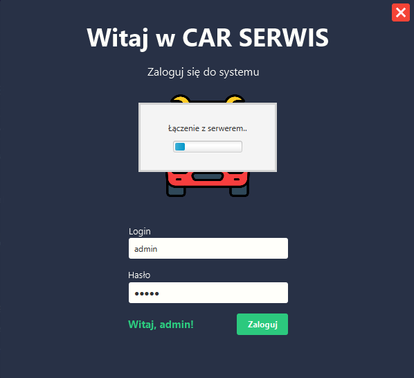

# Car Serwis
### System zarządzania serwisem samochodowym

## Technologie
- JavaFX
- CSS
- Hibernate

## WYGLĄD APLIKACJI

- ### Okno logowania

- ### PULPIT

- ### ZLECENIA

- ### WARSZTAT

- ### KSIĘGOWOŚĆ

- ### MAGAZYN

- ### USTAWIENIA
